## Basic Photo Editor (Streamlit Image Processing App)

### Overview
Interactive desktop-style GUI built with **Python + Streamlit** for an Image Processing course project. Upload an image, apply operations, and see **live updates** for the processed output, histograms, and Fourier spectrum.

### Run

```bash
pip install -r requirements.txt
streamlit run app.py --server.headless true --server.port 8511 --server.fileWatcherType none
```

### Features
- Upload JPG/PNG/BMP + show image info
- Histogram (gray + RGB) + histogram equalization (gray + luminance-only for color)
- Spatial filtering: Sobel (x/y/magnitude) + Laplacian (ksize/scale/delta)
- Fourier transform: FFT2, fftshift, log-magnitude spectrum
- Add noise: salt-and-pepper + periodic noise
- Remove noise:
  - Median filter
  - Periodic noise: automatic notch, automatic band-reject, interactive mask-based removal (click 2 spectrum points)
- Editing: crop, rotate, resize, brightness/contrast
- Undo, reset, download processed image

---

### Processing pipelines

Each diagram shows the **data flow** for one operation: boxes are steps, arrows show what is passed to the next step. Most tools use **Preview → Apply** so you can compare before committing to the working image.

#### App workflow (all pages)

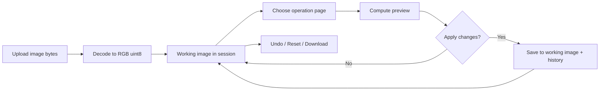

---

#### 1. Image upload & analysis

**Upload** — load and normalize the file.

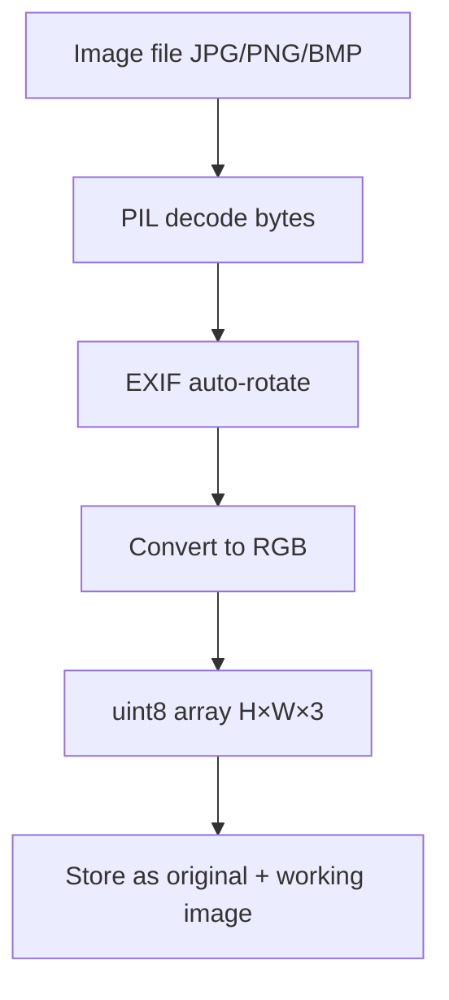

**Histogram view** (Upload page) — intensity distribution of the working image.

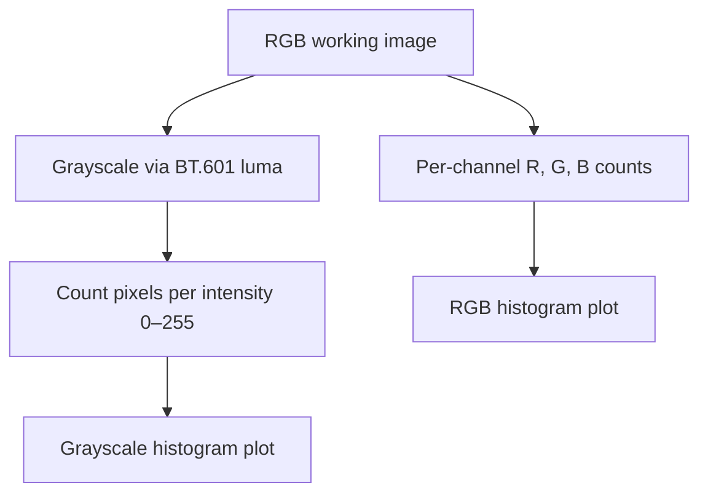

---

#### 2. Histogram equalization (automatic contrast)

Redistributes pixel intensities so the histogram is flatter — this **improves contrast automatically** (different from the manual **Brightness / contrast** slider on the Image Editing page). Color images only equalize **luminance**, not hue.

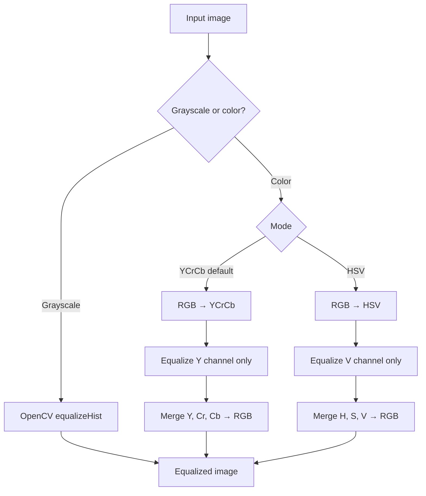

---

#### 3. Spatial filtering (edges)

Both filters run on **grayscale**, then the result is shown as a gray RGB preview.

**Sobel** — horizontal, vertical, or gradient magnitude edges.

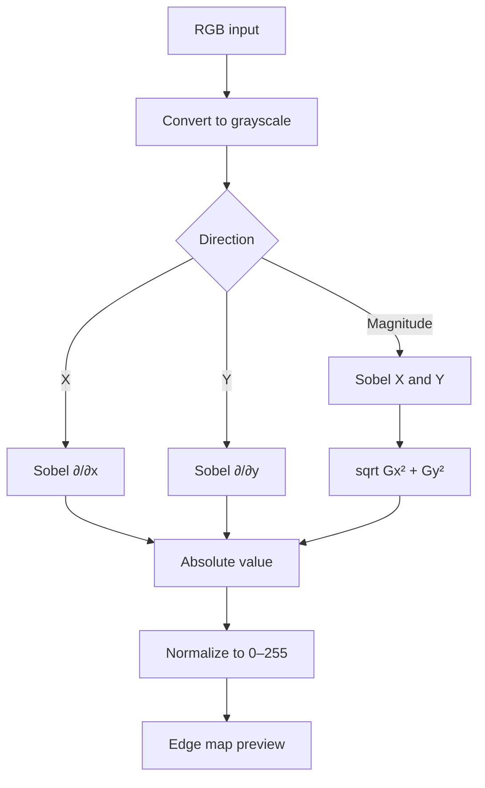

**Laplacian** — second-derivative / sharpness emphasis.

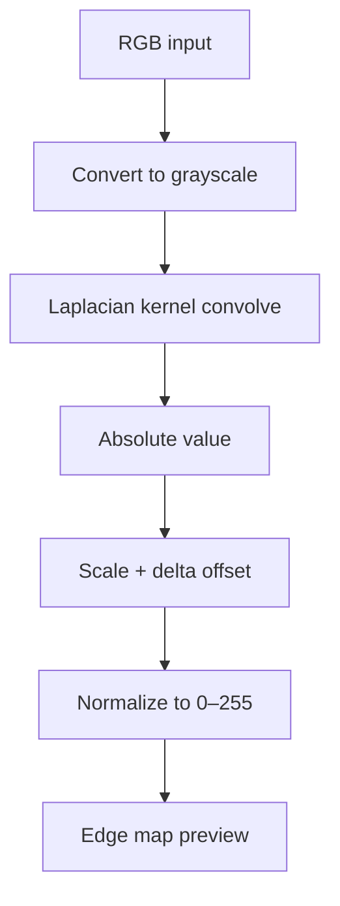

---

#### 4. Fourier transform (spectrum view)

Shows **where** frequency energy lives in the image (no image change).

```mermaid
flowchart TD
  A[RGB working image] --> B[Grayscale]
  B --> C[2D FFT]
  C --> D[fftshift — DC at center]
  D --> E[Magnitude |F|]
  E --> F[log1p for display range]
  F --> G[Normalize to 0–255]
  G --> H[Log-magnitude spectrum image]
```

---

#### 5. Add noise

**Salt & pepper** — random impulse noise (white/black pixels).

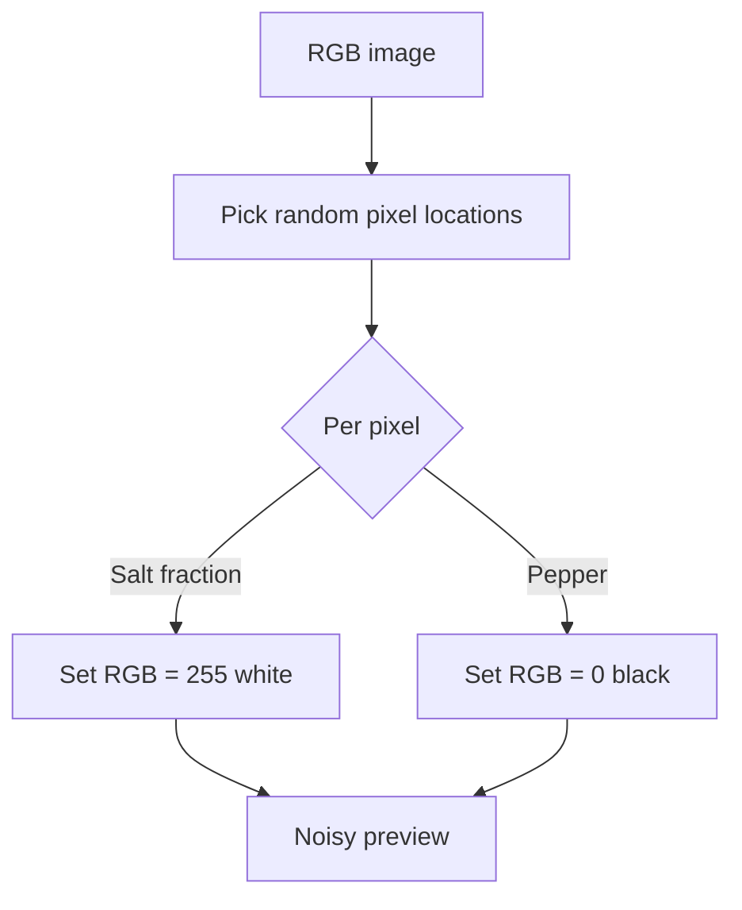

**Periodic noise** — sinusoidal pattern overlaid on the image.

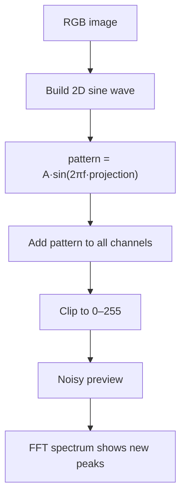

---

#### 6. Remove noise

**Median filter** — best for **salt & pepper** (spatial domain).

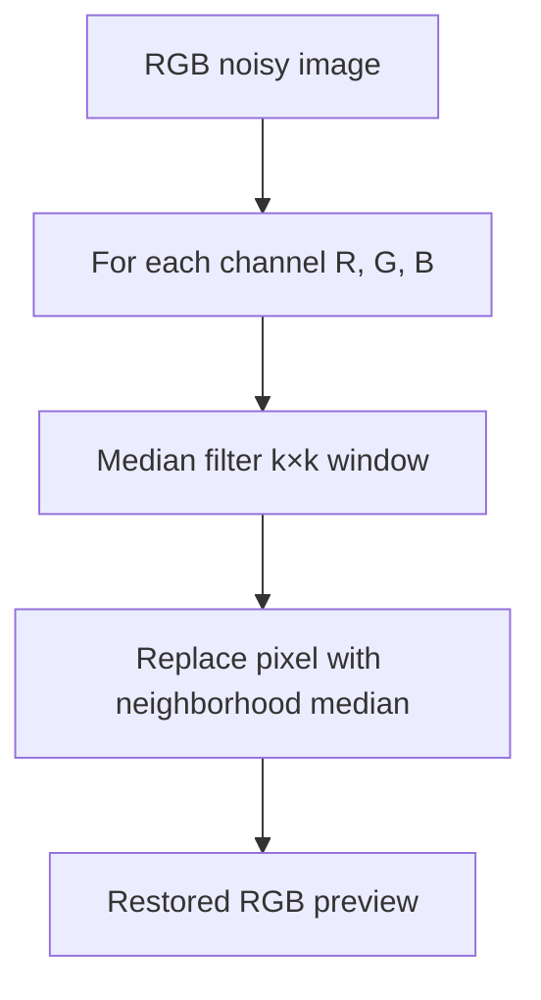

**Automatic notch filter** — removes **periodic** noise via frequency peaks.

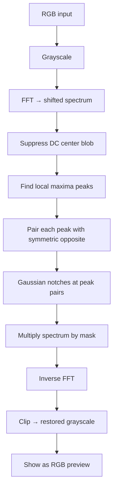

**Automatic band-reject** — rejects whole **rings** of radius around the spectrum center.

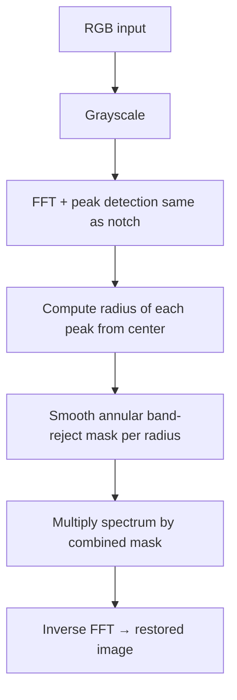

**Interactive mask (2 clicks)** — you pick two points on the spectrum.

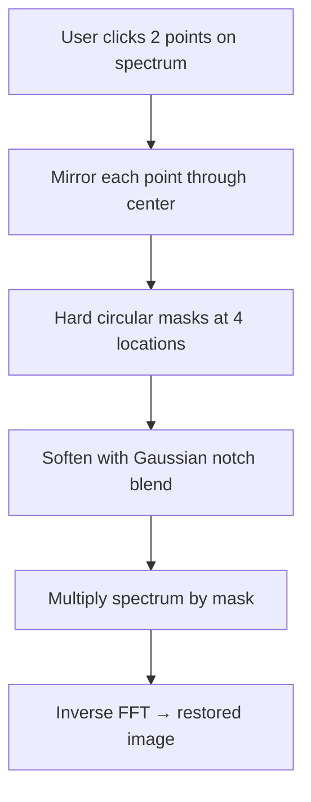

Shared **frequency-domain reconstruction** (used by all periodic removal methods):


---

#### 7. Image editing

**Crop**

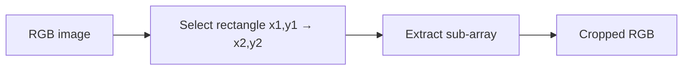

**Rotate**

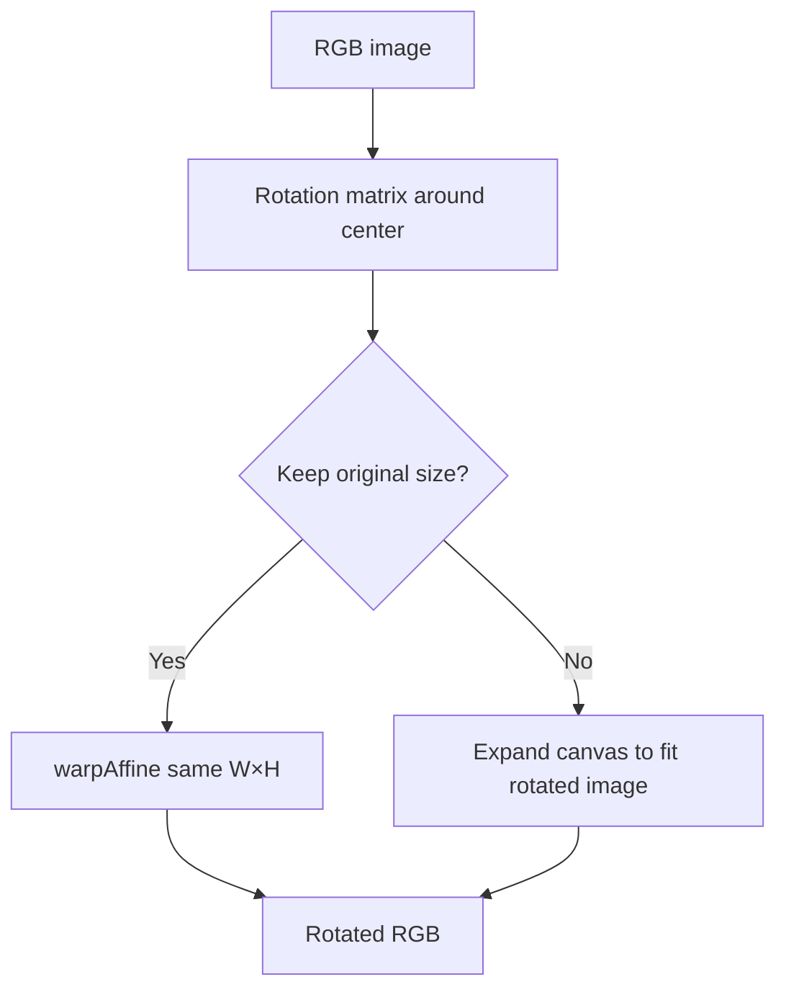

**Resize**

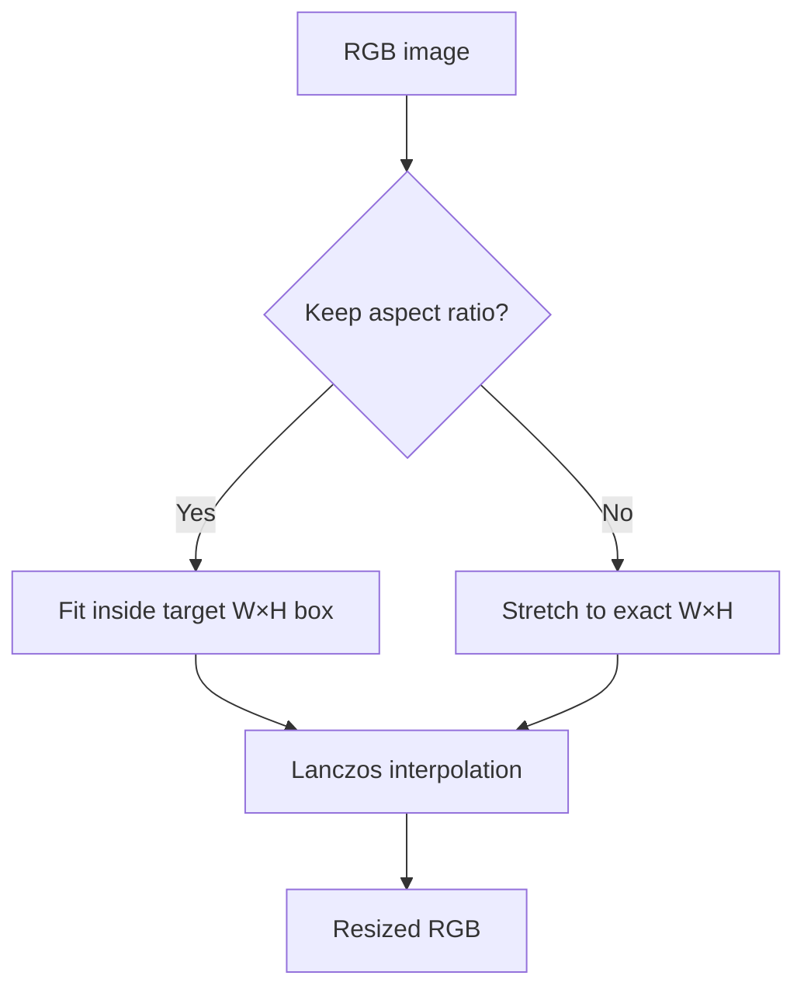

**Brightness & contrast** (Image Editing page)

Manual adjustment on every RGB channel using a linear formula (see `core/editing.py`):

`new_pixel = contrast × old_pixel + brightness`

| Control | Slider range | Effect |
|--------|----------------|--------|
| **Contrast** | 0.0 – 3.0 (default 1.0) | Scales how far each pixel is from black. **&lt; 1** flattens the image (low contrast); **&gt; 1** stretches differences (high contrast). |
| **Brightness** | −255 – 255 (default 0) | Shifts all intensities up or down after scaling. |

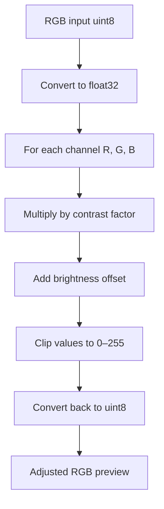

**What contrast does (intuition)**

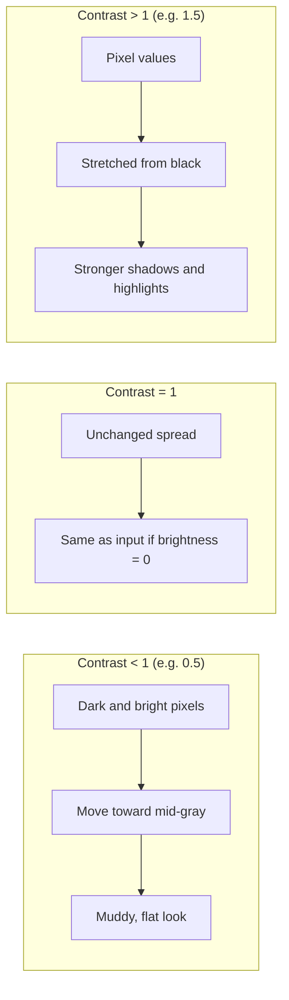

**Contrast vs histogram equalization**

| | Histogram equalization | Brightness / contrast slider |
|--|------------------------|------------------------------|
| **Where** | Histogram Operations page | Image Editing page |
| **How** | Remaps intensities using the image histogram | Simple linear scale + shift per pixel |
| **Goal** | Spread histogram automatically | You control strength with sliders |

---

#### 8. Undo, reset, download

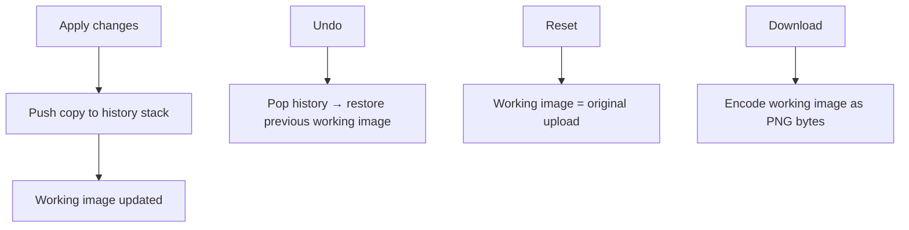

---

### Structure
```
app.py
requirements.txt
APP_README.md
assets/
sample_images/
outputs/
core/
ui/
```
